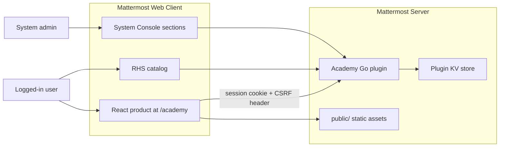

# Architecture

Technical shape of Mattermost Academy for stakeholders who need architecture, capabilities, and operations without implementation detail.

Plugin id `com.mattermost.academy`. License Apache-2.0. Repo: [mattermost/mattermost-plugin-academy](https://github.com/mattermost/mattermost-plugin-academy).

---

## 1. Summary

Mattermost Academy is an in-product learning experience: short, interactive guides for end-users and admins. It registers as a full-screen **product** at `/academy` (same class of UI as Boards or Playbooks), plus a right-hand sidebar catalog and several entry points (product switcher, apps bar, channel header, help menu, `/learn`). Guides are authored in code, not a CMS. Progress and badges are persisted per user.

---

## 2. Architecture

**Three deliverable sides** (standard Mattermost plugin layout):

- **Server** ([server/](../server/)): Go 1.25. HTTP APIs, `/learn` slash command, access policy, progress persistence. Entry: [server/plugin.go](../server/plugin.go).
- **Webapp** ([webapp/](../webapp/)): React 18 + TypeScript + Redux (`mattermost-redux`) + Webpack. Catalog, lessons, badges, admin console UI. Bootstrap: [webapp/src/index.tsx](../webapp/src/index.tsx).
- **Public** ([public/](../public/)): Guide images/SVGs. Served by Mattermost, not by plugin HTTP.

**What the plugin does *not* have:** its own database, host, container, cron jobs, or identity provider. It assumes Mattermost Server **10.3.0+** (`min_server_version` in [plugin.json](../plugin.json)). README states the product requirement as “supported ESR or later.”

**Runtime split of responsibility:**

- Content and lesson UI live in the webapp.
- Access policy, progress/completions, and admin reporting live on the server.
- Mattermost provides session auth, System Console, product shell, and KV storage.

---

## 3. Key features

- **Interactive guides** — Modules with screenshots, tips, variants, checklists, command lists, and optional tiers.
- **Catalog** — Full-screen `/academy` with audience filters (end-user / admin / all). Admin-audience guides are hidden from non-admins unless Test Mode is on.
- **RHS catalog** — Compact catalog with progress; typically opened from the apps bar.
- **Progress** — Per-module completion, continue vs review, “ever completed” even if a guide’s modules later change.
- **Badges** — Earned on guide finish; optional display on profile popovers.
- **Plugin gating** — A guide or module can require another plugin (e.g. Boards, Playbooks). Hidden unless that plugin is present, or Test Mode is on.
- **Access controls** — Who can see Academy at all, and which guides are enabled (System Console).
- **Completion reporting** — System Console chart of completions over time, plus CSV export (system admins).
- **Entry points** — Product switcher, apps bar → RHS, channel header, help menu, `/learn`.

**Shipped guides on master**

- End-user: Collaboration Basics, Productivity Tips, AI Acceleration with Agents, Advanced Search Techniques, Project Tracking with Boards, Workflow Automation with Playbooks.
- Admin: Upgrading Mattermost.

**In-product routes** (SPA under `/academy`, not plugin APIs): catalog; `/guides/:id` (resume); `/guides/:id/modules/:moduleId` (lesson); `/guides/:id/done` (badge).

---

## 4. Content model

Guides are **static TypeScript objects** in [webapp/src/content/guides/](../webapp/src/content/guides/), registered in catalog order in [webapp/src/content/index.ts](../webapp/src/content/index.ts). Not markdown, not a CMS. Structure: Guide → Modules → Steps. Some copy allows a tiny “rich text” subset (`<strong>` and safe links).

Lesson images live under `public/guides/assets/<guideId>/`. **New content ships as a plugin release** (code change + rebuild + deploy).

---

## 5. Data storage

No SQL schema of its own. Persistence is:

| Store | What it holds |
|-------|----------------|
| **Mattermost plugin KV** | Progress, completions, lookup indexes ([server/progress/](../server/progress/)) |
| **Plugin settings** (System Console / `config.json`) | Profile-badge toggle, user-access JSON |

**KV shape (conceptual):**

- Per user + guide: completed module IDs, timestamps, whether the guide was ever finished.
- Per user: list of guides with progress; list of finished guides (badges / reporting).
- Global: set of users who have completed anything (so admin charts do not scan every user).

**Not persisted:** the catalog itself, estimated minutes, visibility (computed from audience + installed plugins + disabled guides).

**Browser storage:** no product `localStorage`. `sessionStorage` is only used to restore the Academy URL across a plugin reload. Short in-memory cache (~15s) for plugin settings on the client.

On plugin activate, the server ensures KV indexes exist (one-time migration). There are **no scheduled jobs**.

---

## 6. Authentication and security

Academy does **not** invent login. Browser calls `/plugins/com.mattermost.academy/...` with the Mattermost session cookie (`credentials: 'same-origin'`). Mattermost authenticates the session and injects `Mattermost-User-Id`. Empty user id → 401. No plugin API keys or OAuth.

**Authorization layers:**

- **Academy usage** — all users, or an allow-list of users and/or teams ([server/access.go](../server/access.go)). Denied users do not get progress APIs; the webapp also unregisters the product so entry points disappear. If settings fail to load, the UI **fails open** (shows Academy) — worth knowing for lockdown deployments.
- **Disabled guides** — PUT progress rejected for those IDs.
- **Admin stats/CSV** — requires Mattermost `PermissionManageSystem`.
- **Profile completions** — any logged-in user may read another user’s finished-guide list **if** profile badges are enabled (needed for popovers).

**Other hygiene:**

- CSRF: clients send `X-Requested-With: XMLHttpRequest` (Mattermost’s usual plugin pattern).
- XSS: lesson rich text is parsed, not dumped as HTML; only `<strong>` and `https://` or site-root links.
- CSV export sanitizes formula-like cells.
- Guide/user IDs validated against a strict character set.
- No application secrets in the plugin. Deploy tooling uses `MM_SERVICESETTINGS_SITEURL` plus admin user/password or token.

No `SECURITY.md`; checks are inline on HTTP handlers, not a separate auth framework.

---

## 7. HTTP API (plugin)

Base: `/plugins/com.mattermost.academy`

- `GET /api/v1/settings` — badges, access, disabled guides, admin/test flags
- `GET /api/v1/progress` and `GET|PUT /api/v1/progress/{guideId}` — logged-in + Academy access
- `GET /api/v1/users/{userId}/completions` — logged-in; badges must be on
- `GET /api/v1/admin/stats/completions-over-time` — system admin
- `GET /api/v1/admin/stats/completions.csv` — system admin

Slash command: `/learn` (server registers it; webapp hook navigates to `/academy`).

---

## 8. Configuration (System Console → Plugins → Mattermost Academy)

Three custom sections ([plugin.json](../plugin.json)). The first two are saved plugin settings; Guide completions is a live view over KV data.

**Profile badges** — Toggle: show completed-guide badges on profile popovers (default on). Users still earn badges either way.

**Access** — Who can use Academy, and which guides are on.

- Users: **Allow for all** (default) or **Allow for selected** people and/or teams. Disallowed users never see Academy in the product.
- End-user / Admin guides: checkbox per shipped guide. Unchecked = hidden from the catalog and progress writes rejected. Guides that need a plugin that is not running (Boards, Playbooks) are marked hidden, with a link to Manage plugins.
- Test Mode (default off): show admin guides to everyone and skip plugin-gating. For content review, not production.

**Guide completions** — Reporting only. Line chart of completion counts; filter by guide and duration (All time, Last 30 days, Previous month, Last 6 months, Last year); CSV export (`user_id`, `username`, `email`, names, `guide_id`, `completed_at`).

---

## 9. Testing and CI

| Layer | How |
|-------|-----|
| Server unit | `go test` under [server/](../server/) (progress, access, command, config, capabilities) |
| Webapp unit | Jest + Testing Library |
| Lint | golangci-lint, ESLint (`make check-style`) |
| E2E | Cypress 15 in [e2e-tests/cypress/](../e2e-tests/cypress/) — smoke: catalog/progress, badges, admin CSV |

Commands: `make test`, `make coverage` (Go HTML), `make e2e` / `make e2e-open` against a running Mattermost.

**CI**

- [.github/workflows/ci.yml](../.github/workflows/ci.yml) — shared Mattermost `plugin-ci` (lint, unit, build) on PRs, `master`/`main`, version tags.
- [.github/workflows/e2e.yml](../.github/workflows/e2e.yml) — Docker Mattermost + Postgres → deploy plugin → Cypress.

No enforced coverage gate in-repo. E2E is smoke, not full curriculum coverage.

---

## 10. Build, deploy, and infrastructure

**Artifact:** `dist/com.mattermost.academy-*.tar.gz` from `make` / `make dist` (manifest version from git tags, multi-arch server binaries, webapp bundle).

**Install:** System Console upload, or `make deploy` via `pluginctl`. Production = “plugin enabled on an existing Mattermost.” No extra runtime.

**Local:** Go 1.25+, Node 16+/npm 8+, a Mattermost server. Optional Docker stack: [e2e-tests/docker-compose.yml](../e2e-tests/docker-compose.yml) (Postgres 15 + Mattermost on `:8065`). `make watch` rebuilds the webapp; hard-refresh after deploy.

**Observability:** Mattermost plugin logs only (`client.Log`). `pluginctl logs` for deploy-time tailing. No Prometheus, tracing, or product telemetry (Rudder/etc.). The only “analytics” are admin completion charts/CSV from KV.

**i18n:** None. UI and guide copy are hardcoded English. Adding localization later would follow Mattermost `en.json` conventions.

---

## 11. Distribution / roll-out

Planned path (not current `master` behavior). Today the plugin is a separately installed `.tar.gz`.

1. **Staff Hub (internal)** — Publish to Mattermost Staff Hub for internal dogfooding.
2. **Customer hand-raisers** — After security review, share the plugin with customers who have opted in, to collect initial feedback.
3. **Iterate, then prepackage in Q4** — Fold that feedback into the product, then **prepackage Academy with the Mattermost server binary** in Q4 so it ships with the server (no separate upload).

---

## 12. Notable constraints (for reviewers)

- Content changes require a plugin release, not an admin CMS.
- Progress is KV, not queryable SQL; reporting is built for the current chart/CSV, not a general warehouse.
- Plugin-gated guides (Boards, Playbooks) depend on those plugins being installed, unless Test Mode is on.
- Fail-open UI if settings cannot be loaded; server APIs still enforce access.
- Profile completion API is intentionally readable by peers when badges are on.
- Minimum server 10.3.0; no standalone HA story beyond whatever Mattermost already provides.
